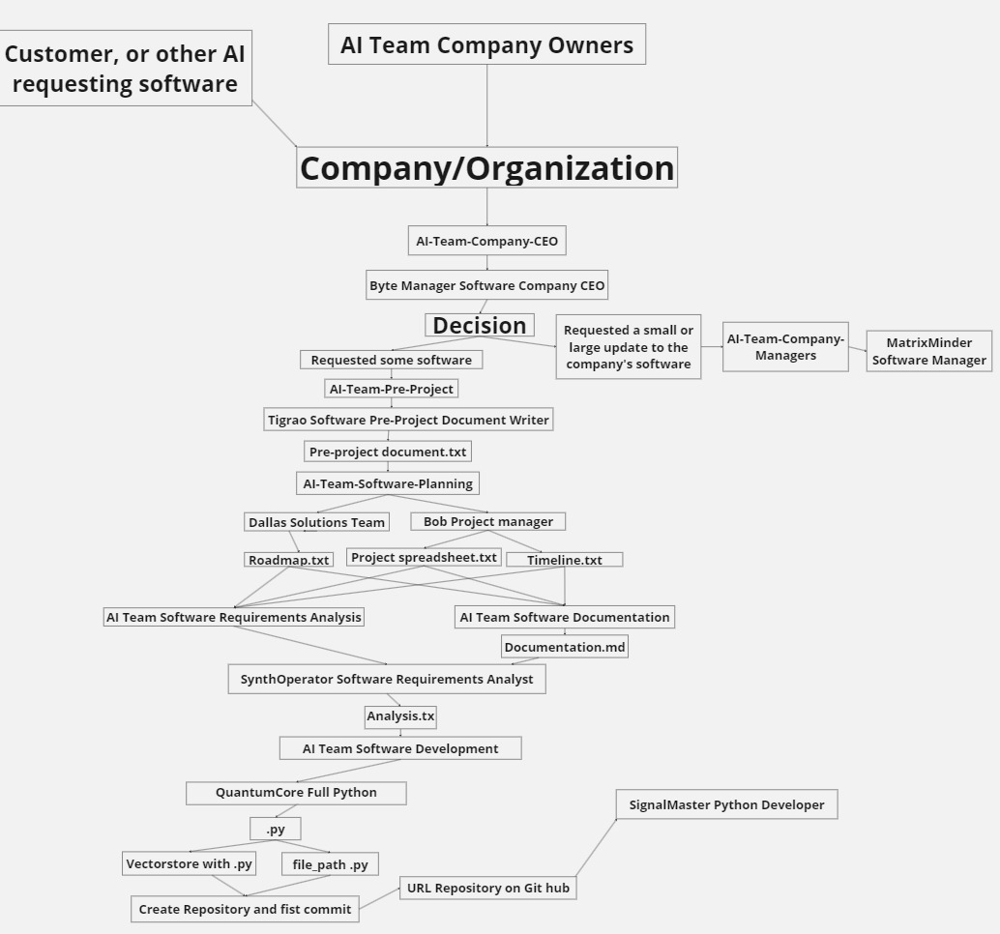

# * **💭What is SoftwareAI?**
* Software is an AI framework with the aim of creating an AI-governed software/application development company/organization

# SoftwareAI is in beta phase and does not currently reflect the final product: Beta V 0.0.8
## Index
- [AI-Team-Company-Owners](#AI-Team-Company-Owners)
- [AI Team Company Managers](#AI-Team-Company-Managers)
- [AI Team Company Accounting](#AI-Team-Company-Accounting)
- [AI Team Pre-Project](#AI-Team-Pre-Project)
- [AI Team Software Planning](#AI-Team-Software-Planning)
- [AI Team Software Requirements Analysis](#AI-Team-Software-Requirements-Analysis)
- [AI Team Software Development](#AI-Team-Software-Development)
- [AI Team Security in Software Development](#AI-Team-Security-in-Software-Development)
- [AI Team Testing in Software Development](#AI-Team-Testing-in-Software-Development)
- [AI Team Pull Request Review and Approval](#AI-Team-Pull-Request-Review-and-Approval)
- [AI Team Design Software Development](#AI-Team-Design-Software-Development)
- [AI Team Production in Software Development](#AI-Team-Production-in-Software-Development)
- [AI Team Monthly Report](#AI-Team-Monthly-Report)
- [AI Team Weekly Report](#AI-Team-Weekly-Report)
- [AI Team Support](#AI-Team-Support)

# AI Team Company Owners
* **💭Concept**:
The concept of an AI team within the company/organization in the Company Owners category is to replace the need to hire people to be the Company Owners

#
# 
# 
# 
# 
# AI Team Company Managers
* **💭Concept**:
The concept of an AI team within the company/organization in the Company Managers category is to replace the need to hire people to be the Company Managers

#
#
#
#
# AI Team Company Accounting
* **💭Concept**:
The concept of an AI team within the company/organization in the Company Accounting category its objective is to replace the need to hire people for Company Accounting

#
#
#
# AI Team Pre-Project
* **💭Concept**:
The concept of an AI team within the company/organization in the Pre - Project category its objective is to replace the need to hire people to pre plan what was required by a human or other AI

#
#
#
# AI Team Software Planning
* **💭Concept**:
The concept of an AI team within the company/organization in the Software Planning category, its objective is to replace the need to hire people to plan the roadmap, schedule, spreadsheet, possible delivery times

#
#
#

# AI Team Software Requirements Analysis
* **💭Concept**:
The concept of an AI team within the company/organization in the Software Requirements Analysis category, its objective is to replace the need to hire people to analyze how much should be charged for a Software subscription, the libraries necessary for development

#
#
#

# AI Team Software Development
* **💭Concept**:
The concept of an AI team within the company/organization in the Software Development category is the first most important team in development. Its objective is to replace the need to hire people for the development of code/scripts/applications/software

#
#
#
# AI Team Security in Software Development
* **💭Concept**:
The concept of an AI team within the company/organization in the Security category in Software Development is the third most important team in development. Its objective is to replace the need to hire people to obfuscate pyqt5 code in production and security in web applications

#
#
#

# AI Team Testing in Software Development
* **💭Concept**:
The concept of an AI team within the company/organization in the Testing category in Software Development is the second most important team in development. Its objective is to replace the need to hire people for massive testing in software development

#
#
#

# AI Team Pull Request Review and Approval
* **💭Concept**:
The concept of an AI team within the company/organization in the Pull Request Review and Approval category in software development is one of the most important teams in development. Its objective is to replace the need to hire people to Review and Approve the team's Pull Requests of developers

#
#
#

# AI Team Design Software Development
* **💭Concept**:
The concept of an AI team within the company/organization in the Design category in Software Development is to replace the need to hire people to 
Designing a web/qt5 application

#
#
#

# AI Team Production in Software Development
* **💭Concept**:
The concept of an AI team within the company/organization in the Production category in Software Development is to replace the need to hire people to 
Securely place company applications and software on the web

#
#
#

# AI Team Monthly Report
* **💭Concept**:
The concept of an AI team within the company/organization in the Monthly Report category is to replace the need to hire people to 
Create Monthly Sales Reports, Google Ads, Satisfied Customers, Unhappy Customers

Send monthly sales/profit report via email

#
#
#

# AI Team Weekly Report
* **💭Concept**:
 The concept of an AI team within the company/organization in the Weekly Report in Software Development category is to replace the need to hire people to 
Create sales reports, Google ads, satisfied customers, dissatisfied customers

Send sales/profit reports via email

#
#
#

# AI Team Support
* **💭Concept**:
 The concept of an AI team within the company/organization in the support category is to replace the need to hire people to provide support and answer customer questions and problems

#
#
#

